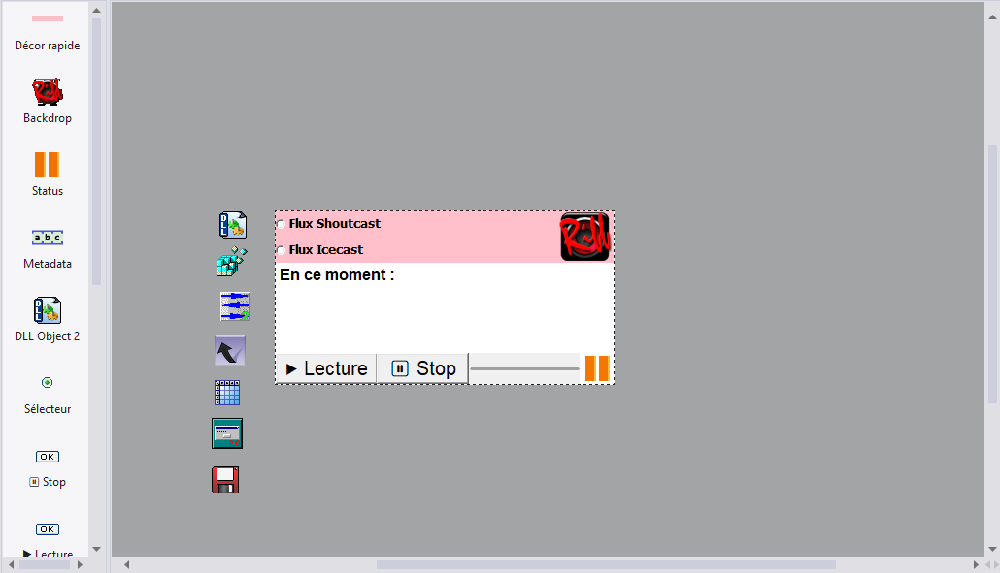

# Créer un client Shoutcast/Icecast sous Clickteam Fusion 2.5

## Introduction

Ce guide vous permettra de créer un client Windows pour les technologies de streaming audio Shoutcast et Icecast, sous l'outil de développement no-code **[Clickteam Fusion 2.5](https://www.clickteam.com/fr/clickteam-fusion-2-5)** à l'aide de l'extension **DLL Object** et de la bibliothèque **BASS.dll**. L'objectif est d'apprendre à interagir avec une DLL externe sous Clickteam Fusion, en vue de créer un lecteur minimaliste pour webradio basé sur l'une et/ou l'autre technologie de streaming, identique au client **Riff Micro-Player**, [dont le code source est disponible ici](https://github.com/blablabla).

### Portée

Ce guide se concentrera sur l'interaction avec BASS.dll via le DLL Object. La gestion de l'interface de l'application, ainsi que de l'enregistrement et du chargement des préférences utilisateur, ne seront pas abordés, sauf dans les situations où cela est nécessaire pour comprendre l'interaction avec la DLL. Si ces points vous intéressent, reportez-vous au code source commenté de l'application de démonstration **Riff Micro-Player**.

Le client sera adapté à l'infrastructure de diffusion spécifique de la webradio [Riff](https://www.riff-radio.org), qui a la particularité de proposer ses flux dans les deux protocoles Shoutcast et Icecast, et de proposer une API permettant de recueillir des métadonnées telles que le titre en cours de diffusion. Néanmoins, le client pourra être adapté, avec très peu de modifications, à n'importe quel flux Shoutcast ou Icecast.

À la fin de ce guide, vous saurez :

- Interagir avec une DLL externe via l'extension **DLL Object**.
- Récupérer le son et les métadonnées d'un flux Shoutcast/Icecast grâce à **BASS.dll**
- Contrôler la lecture et le volume du flux.
- Récupérer certaines données textuelles d'une API externe via **GET Object**.
- Gérer les différentes erreurs pouvant être renvoyées par **BASS.dll**.

### Prérequis

Pour pouvoir suivre ce guide et en répliquer toutes les étapes, vous aurez besoin de :

- Clickteam Fusion 2.5 en version standard complète (la Free Edition est insuffisante). Nous utiliserons l'interface en français. Pensez à changer la langue du logiciel dans les préférences si ce n'est pas votre cas.
- Les extensions **DLL Object**, **String Parser**, **Get Object** et **Trackbar**, à récupérer dans le gestionnaire d'extensions de CF 2.5
- La bibliothèque BASS.dll (version 2.4.18 ou supérieure) pour Windows, [à télécharger sur le site de Un4seen Developments](https://www.un4seen.com/bass.html)

> ⚠️ BASS.dll est une bibliothèque propriétaire de Un4seen Developments. Son usage est gratuit pour une utilisation non commerciale, mais une licence payante est requise pour toute utilisation commerciale.

Ce guide est conçu pour des utilisateurs déjà en mesure de développer des applications Windows sous Fusion 2.5. Il est attendu de vous que vous sachiez déjà :

- Utiliser l'éditeur de scènes, l'éditeur d'événements ou de liste d'événements, ainsi que l'éditeur d'expression, pour créer une application de base
- Modifier les propriétés de l'application, d'un objet, les valeurs et chaînes globales (y compris leur nommage)
- Télécharger et utiliser des extensions pour CF2.5
- Comprendre des notions de base telles que les entiers (integer), chaînes (string), extractions de sous-chaînes, etc.

### Conventions de notation

Afin de fluidifier la lecture, nous adopterons certaines conventions de notation qui ne seront pas réexplicitées par la suite :

#### Appels à la DLL via DLL Object

Nous utiliserons une convention de type `return_type Fonction("argument_string", argument_integer, argument_integer)`. Par exemple `int Fonction("stuff", 1, 500)` Cela signifie que vous devez créer les actions suivantes dans l'objet DLL :

- Arguments > No Arguments (clear all)
- Arguments > Add Argument String > Expression `"stuff"`
- Arguments > Add Argument Integer > Expression `1`
- Arguments > Add Argument Integer > Expression `500`
- Return Value > Return Integer
- Call Function > Expression `"Fonction"`

Ainsi, vous partez d'une liste d'arguments vide, puis vous ajoutez tous les arguments indiqués entre parenthèses dans le présent guide, puis vous appelez la fonction (le DLL Object passera automatiquement tous les arguments préalablement définis).
Notez que vous n'êtes pas obligé de préciser le type d'argument retourné par la DLL si vous êtes sûr que celui-ci ne change pas entre deux commandes (par exemple si vous lancez deux commandes à la suite qui retournent toutes deux un integer). Ce guide précisera néanmoins systématiquement le type d'argument renvoyé par la DLL, par souci pédagogique.
Notez également qu'en cas de parenthèses vides (`Fonction()`), aucun argument ne doit être ajouté, mais pensez quand même à précéder l'appel de fonction d'un « No Arguments (clear all) » afin de vider la liste d'arguments et de bien passer un appel sans argument. Sinon, vous enverrez les arguments fixés lors de l'appel précédent.
Enfin, signalons que si vous devez appeler plusieurs fonctions consécutives ayant des arguments presque identiques, au lieu de réinitialiser la liste d'arguments et de les réécrire entièrement, vous pouvez utiliser les fonctions `Set Argument` de DLL Object, qui permettent de remplacer le contenu d'un argument sans toucher aux autres.

#### Cumul de fonctions au sein d'un même événement

Nous utiliserons le signe « **+** » pour indiquer plusieurs conditions cumulatives à ajouter au même événement, et **OR** pour l'opérateur du même nom sous Fusion.

#### Ordre des actions

Les actions devant parfois être effectuées dans un certain ordre, elles seront données dans ce guide dans l'ordre chronologique. Il arrivera donc que le guide vous demande d'effectuer des actions sur un objet, puis sur un autre, puis de revenir au premier. Vous devrez suivre cet ordre scrupuleusement.

## Mise en place du projet

Commencez par créer une nouvelle application sous Fusion et par l'enregistrer dans un répertoire qui lui est propre. Vous y placerez votre fichier .MFA, ainsi que le fichier BASS.dll que vous aurez préalablement téléchargé et décompressé.

Dans l'éditeur de texte, créez trois objets **Bouton** : un bouton poussoir « Lecture », un bouton poussoir « Stop », et un bouton radio « Sélecteur »

Créez deux lignes de texte dans votre bouton radio Sélecteur :

```text
Flux Shoutcast
Flux Icecast
```

Créez ensuite un objet **Trackbar**, qui servira de contrôle de volume de votre lecteur, ainsi qu'un objet Chaîne, que vous nommerez « Metadata » et dans lequel nous afficherons le Titre et l'Artiste du morceau en cours de diffusion par la radio.

Enfin, ajoutez ensuite au minimum à votre scène les extensions suivantes : **DLL Object**, **String Parser**, **Tableau** et **Get Object** (une de chaque).

Voilà un aperçu de ce que vous devriez obtenir :


> **Remarque :** La capture d'écran ci-dessus contient un peu plus d'objets que le nécessaire indiqué dans ce guide car elle comprend également les objets permettant de réaliser les étapes décrites dans la section « Pour aller plus loin », en fin d'article.

### Valeurs globales

Dans les propriétés de l'application, créez les valeurs globales suivantes (nous n'aurons pas besoin de chaînes globales) :

`streamHandle` : Servira à stocker le handle du flux renvoyé par BASS.
`errorCode` : Permettra de stocker un éventuel code d'erreur renvoyé par BASS, pour le debugging.
`initComplete` : Servira de booléenne : confirmera que le flux est prêt à être écouté.
`streamState` : Permettra de stocker l'état du flux, tel que renvoyé par BASS. **Fixez immédiatement cette valeur à `-1` (moins un) depuis les propriétés de l'application. Vous comprendrez pourquoi lorsque l'on abordera la gestion des erreurs.**
`onError` : Servira de booléenne : indiquera que nous venons de détecter une erreur « rattrapable ».

Une fois ceci fait, vous pouvez accéder à l'Éditeur d'événements pour concevoir la logique de votre lecteur.

## Logique

### Initialisation

#### Initialiser

Nous allons immédiatement initialiser BASS et commencer à lire le flux, avant même que l'utilisateur appuie sur le bouton **Lecture**, afin de pouvoir récupérer les métadonnées (Artiste - Titre).

Créez un groupe d'événements nommé « Init/Fin ».

À l'intérieur de celui-ci, créez un événement `En début de scène`, avec les actions suivantes :

**Objet Tableau**

- Écrire chaîne `"http://stream.riff-radio.org:80"` en `(0)`
- Écrire chaîne `"http://stream.riff-radio.org:8008/riffcast"` en `(1)`

**DLL Object**

- Load DLL : Saisissez l'expression `AppPath$ + "bass.dll"`
- Calling Convention > **\_\_cdecl**
- `int BASS_Free()`
- `int BASS_Init(1, 44100, 0, 0, 0)`
- `int BASS_Init(0, 44100, 0, 0, 0)`

À ce stade, BASS.dll est chargé, préconfiguré et prêt à décoder un flux. Notez qu'il a été initialisé deux fois, sur deux sorties différentes : la sortie audio par défaut de l'utilisateur (1), et une sortie fantôme (0), qui sera utilisée ultérieurement pour passer le flux en muet sans interrompre la lecture.

#### Lancer le flux choisi par l'utilisateur

Continuez sur le même événement, en ajoutant les actions suivantes :

**DLL Object**

- `int BASS_StreamCreateURL(StrAtX( "Tableau", Selected Radio( "Sélecteur" ) ), 0, 0, 0, 0)`

Ici, nous demandons à BASS.dll d'aller chercher le flux dont l'URL se trouve dans le tableau, en indiquant comme index du tableau le numéro du bouton sélectionné. Ainsi, si le bouton 0 est sélectionné, le flux demandé correspond à l'adresse du flux Shoutcast, et si le bouton 1 est sélectionné, c'est l'adresse du flux Icecast qui est passée en paramètre.

**Objet Spécial**

- Fixer `streamHandle` à `GetReturnInt("DLL Object")`

Ceci vous permettra de récupérer la valeur renvoyée par BASS.dll suite à la commande précédente, laquelle contient un numéro unique identifiant le flux. Il nous sera utile par la suite.

**DLL Object**

- `int BASS_ChannelSetDevice(streamHandle, 0)`
- `int BASS_ChannelSetAttribute(streamHandle, 2, value( "Trackbar" ) / 100.0)`
- `int BASS_ChannelPlay(streamHandle, 1)`

Ici, nous paramétrons le flux pour qu'il soit joué sur la sortie fantôme (no sound), au volume défini par la trackbar (qui doit être divisée par 100 car BASS attend une valeur décimale entre 0 et 1). Notez comme toutes les commandes, désormais, impliquent de passer streamHandle en premier paramètre : BASS a besoin de savoir de quel flux on parle (car il est tout à fait capable d'en gérer plusieurs en simultané).

> ⚠️ Attention, le dernier paramètre de `BASS_ChannelSetAttribute` est de type Float, et pas de type Integer. Ne vous trompez pas dans le type d'argument dans le menu de DLL Object.

Dès lors, le flux est, en pratique, téléchargé et décodé. Mais aucun son n'est envoyé à la carte son de l'utilisateur.

**Objet Spécial**

- Fixez `initComplete` à `1`.

### Affichage des métadonnées

Avant même de commencer à diffuser le son, notre priorité est d'afficher les métadonnées à l'écran de l'utilisateur, qu'il lance la lecture ou non.

La routine va différer fortement selon qu'on soit sur le flux Shoutcast ou sur le flux Icecast. En effet, certaines webradios ne transmettent pas les métadonnées directement intégrées au flux Icecast (dites métadonnées ICY). C'est le cas de Riff. Dans cette situation, nous les récupérerons alors en pollant l'API web.

Quoiqu'il en soit, commencez par créer un groupe d'événements nommé « Lecture meta », puis :

#### Routine Shoutcast

Créez un événement `initComplete = 1` + `Le bouton radio 0 de Sélecteur est activé` + `Toutes les 1 seconde` avec les actions suivantes :

**DLL Object**

- `string BASS_ChannelGetTags(streamHandle, 5)`

**String Parser**

- Set source string to `RRight$(GetReturnString$( "DLL Object" ), Len(GetReturnString$( "DLL Object" )) - 13)`
- Add delimiter `"';StreamURL="`

Arrêtons-nous un instant pour décrypter ce qui se passe ici : En premier lieu, on récupère la chaîne (qui contient les métadonnées) renvoyée par BASS dans l'objet String Parser via `GetReturnString$( "DLL Object" )`. La chaîne reçue ressemble à ceci :
*StreamTitle='David Bowie/ Queen - Under Pressure';StreamUrl='http://www.radio.org';*
Puis nous supprimons *StreamTitle='* en entourant la chaîne d'un Right$(chaîne, Len(bufferICY) - 13) pour récupérer uniquement la partie droite de la chaîne, sur toute sa longueur moins 13 caractères.

Dans un second temps, nous ajoutons le délimiteur *';StreamURL=*, ce qui nous permettra de ne garder que ce qui précède, c'est à dire... L'artiste et le titre proprement dit.

**Objet Chaîne Metadata**

- Fixer la chaîne modifiable à `"En ce moment : " + listGetAt$( "String Parser", 1 )`

Nous récupérons ainsi la chaîne préalablement traitée et l'affichons dans le texte prévu à cet effet.

> 💡 Si nous codions dans un langage de programmation traditionnel, nous pourrions récupérer les métadonnées à l'instant précis où de nouvelles sont transmises dans le flux via `BASS_ChannelSetSync`, en passant une fonction de rappel (callback). Malheureusement, Fusion n'est pas compatible avec ce type de fonctions. C'est la raison pour laquelle on se résout à réclamer les dernières métadonnées connues une fois par seconde.

#### Routine Icecast

Créez un événement `initComplete = 1` + `Le bouton radio 1 de Sélecteur est activé` + `Toutes les 2 seconde` avec les actions suivantes :

**GET Object**

- GET URL `https://api.radio.org/0/meta_last.txt`

Créez ensuite un second événement `On get complete` avec le GET Object, et ajoutez l'action suivante :

**Objet Chaîne Metadata**

- Fixer la chaîne modifiable à `"En ce moment : " + Received$( "Get Object" )`

> 💡 Notez que l'on récupère les métadonnées toutes les deux secondes seulement avec cette routine. Dans la mesure où l'on va poller à chaque fois une API web, plutôt qu'une donnée locale stockée en RAM, nous optons pour un polling un peu moins agressif, par politesse.

### Lire ou arrêter le flux sur la carte son de l'utilisateur

Comme nous le disions précédemment, le flux est décodé en permanence par le logiciel. La « Lecture » consiste donc en réalité à passer le flux de la sortie muette à la sortie « carte son de l'utilisateur » et vice-versa.

Créez un groupe d'événements nommé « Contrôle du flux », puis :

#### Lecture

Créez un événement `Bouton "Lecture" cliqué` + `initComplete = 1` et ajoutez les actions suivantes :

**DLL Object**

- `int BASS_ChannelSetDevice(streamHandle, 1)`

**Objet bouton « Lecture »**

- Désactiver

**Objet bouton « Stop »**

- Activer

**Objet bouton « Sélecteur »**

- Désactiver

#### Arrêt

Créez un événement `Bouton "Stop" cliqué` + `initComplete = 1` et ajoutez les actions suivantes :

**DLL Object**

- `int BASS_ChannelSetDevice(streamHandle, 0)`

**Objet bouton « Lecture »**

- Activer

**Objet bouton « Stop »**

- Désactiver

**Objet bouton « Sélecteur »**

- Activer

#### Changement de volume

Créez un événement `Trackbar value has changed` + `initComplete = 1` et ajoutez les actions suivantes :

**DLL Object**

- `int BASS_ChannelSetAttribute(streamHandle, 2, value( "Trackbar" ) / 100.0)`

### Gérer le changement de flux à la volée

Si l'utilisateur veut passer du flux Icecast au flux Shoutcast, la manière la plus propre de le gérer est de fermer le flux et d'en ouvrir un nouveau. Pour ce faire, créez un événement `Bouton Sélecteur cliqué` et ajoutez les actions suivantes :

**DLL Object**

- `int BASS_ChannelFree(streamHandle)`
- `int BASS_StreamCreateURL(StrAtX( "Tableau", Selected Radio( "Sélecteur" ) ), 0, 0, 0, 0)

**Objet Spécial**

- Fixer `streamHandle` à `GetReturnInt("DLL Object")`

**DLL Object**

- `int BASS_ChannelSetDevice(streamHandle, 0)`
- `int BASS_ChannelSetAttribute(streamHandle, 2, value( "Trackbar" ) / 100.0)`
- `int BASS_ChannelPlay(streamHandle, 1)`

Nous fermons donc simplement le flux précédent, puis reprenons exactement la même procédure qu'au début pour l'ouvrir à nouveau avec le nouveau paramètre.

À ce stade, vous avez déjà conçu un logiciel qui, en principe, fonctionne. Néanmoins, pour être complet, nous allons également aborder les situations où, contre toute attente, le logiciel ne fonctionne pas.

### Gestion des erreurs

Il peut arriver que BASS renvoie une erreur. Que l'utilisateur soit déconnecté d'Internet, que la radio cesse de répondre ou que nous ayons mal géré un cas limite et envoyé des paramètres incorrects, il est nécessaire de pouvoir récupérer et prendre en charge les éventuelles erreurs. Nous allons donc interroger la DLL à intervalles réguliers, pour détecter deux situations :

- Soit BASS renvoie une erreur en bonne et due forme : il s'agit généralement d'un signe que vous avez envoyé une commande avec des paramètres incorrects, ou dans le mauvais ordre.
- Soit nous n'avons pas d'erreur à proprement parler, mais BASS nous informe que la lecture ne se fait pas : il s'agit généralement d'un problème de connexion internet côté utilisateur, ou d'un problème technique côté radio.

#### Gérer les erreurs fatales

Créez un groupe d'événements intitulé « Gestion des erreurs » et ajoutez une condition `Toutes les 2 secondes` + `initComplete = 1`, et ajoutez-y l'action suivante :

**Objet Spécial**

- Fixer `errorCode` à `ReturnInt( "DLL Object", "BASS_ErrorGetCode" )`

Puis, créez l'événement suivant : `errorCode > 0` + `errorCode <> 32` + `errorCode <> 40`.

Vous pouvez ensuite gérer les erreurs comme vous le voulez, selon le principe suivant : si `errorCode` reste égal à zéro, il n'y a pas d'erreur. Si `errorCode` est égal à 32 ou 40, c'est une erreur de connexion, que nous allons traiter à part, juste après. Si l'erreur est supérieure à 0 mais différente de 32 ou 40, c'est une erreur fatale que nous ne prenons pas en charge.

Pensez seulement à repasser immédiatement la valeur `errorCode` à `0` à ce moment-là afin d'éviter que cet événement ne soit vérifié en boucle.

> 💡 Ce type d'erreur n'est pas vraiment censé arriver. Il signale un bug sévère et souvent fatal, nécessitant de reprendre toute la procédure depuis le début. Par conséquent, vous pouvez par exemple utiliser un Popup Object pour afficher un message d'erreur et proposer à l'utilisateur de relancer l'application, avant de forcer l'arrêt pur et simple du logiciel. Mais notez si le problème se reproduit régulièrement, vous avez probablement un bug sévère dans votre logiciel.

#### Gérer les erreurs rattrapables

Lorsque l'erreur indique plutôt un problème de réseau, il peut être intéressant de se donner une deuxième chance avant de couper le logiciel. Dans un souci de simplification, nous n'allons pas essayer dans ce guide de « rattraper » ce type d'erreurs. Nous allons néanmoins les traiter via des événements distincts. Cela vous permettra ensuite, si vous le désirez, d'implémenter un système de récupération sans avoir à repenser toute la logique.
Le [code source commenté](https://github.com/blabla) propose une implémentation possible d'un tel système.

En premier lieu, nous allons vérifier régulièrement l'état de la connexion au serveur. Pour ce faire, créez un événement `Toutes les 5 secondes` + `initComplete = 1` avec les actions suivantes :

**DLL Object**

- `int BASS_StreamGetFilePosition(streamHandle, 4)`

BASS renverra `0` si le flux est déconnecté, `1` s'il est connecté, et `2` s'il est en cours de reconnexion.

**Special Object**

- Fixer `streamState` à `GetReturnInt( "DLL Object" )`

Nous pouvons maintenant tester l'état de cette valeur et agir en conséquence.

##### Si la connexion est en vie et qu'aucune erreur n'est détectée

Créez événement avec une condition de comparaison : `streamState > 0` + `errorCode = 0` avec pour actions :

**Objet Spécial**

- Fixer `onError` à `0`
- Fixer `streamState` à `-1`

Ici, nous sommes dans la situation où le flux n'est pas mort : la connexion est active, ou, au pire, BASS est en train de se reconnecter tout seul. On remet donc le compteur de plantages consécutifs à zéro, et on remet la valeur `streamState` à sa valeur « neutre ».

##### Si le flux est déconnecté ou que la connexion échoue

Créez un événement avec les conditions suivantes `streamState = 0` + `onError = 0` OR `errorCode = 32` + `onError = 0` OR `errorCode = 40` + `onError = 0` et les actions suivantes :

**Objet Spécial**

- Fixer `onError` à `1`
- Fixer `errorCode` à `0`
- Fixer `streamState` à `-1`

Dans cette condition, nous vérifions si nous avons l'une des trois erreurs qui nous intéresse : État du stream déconnecté, Erreur 32 (Pas de connexion internet) ou Erreur 40 (Timeout). Chacune de ces conditions est assortie d'une vérification supplémentaire `onError = 0` : comme l'une des conséquences de cet événement est d'amener `onError à 1`, cela permet d'éviter que l'événement se vérifie en boucle.

##### Quand on a relevé une erreur non-fatale

Créez un événement de comparaison `onError = 1` et mettez-y les actions que vous désirez, tel qu'une fenêtre popup de message d'erreur suivi d'une cloture forcée du logiciel. Ici, on ne cherchera pas à rattraper l'erreur et on peut donc se contenter d'une action identique aux erreurs supposées « irratrappables ». Là encore, à moins de quitter immédiatement le logiciel, vous devrez réinitialiser toutes ces variables à leurs valeurs par défaut afin d'éviter que l'événement ne se vérifie en boucle.

Dans le code source commenté, vous constaterez qu'on incrémente un compteur d'erreurs, et qu'on retente une connexion. C'est seulement une fois que le compteur d'erreurs atteint une certaine limite qu'on déclenche une erreur fatale. Cela apporte de la robustesse au prix d'une complexité algorithmique substantiellement plus élevée.

### Fermeture du logiciel

Afin de fermer proprement le logiciel, revenez au groupe d'événement init/fin et ajoutez l'événement suivant : `Fin de l'application`. Ajoutez alors les actions suivantes :

**Objet DLL**

- `int BASS_ChannelStop(streamHandle)`
- `int BASS_Free()`
- Unload DLL

## Conclusion

Vous venez de créer un logiciel simple, qui ne gère pas tous les cas particuliers et ne sauvegarde pas les préférences utilisateur, mais il est fonctionnel et permet effectivement d'écouter la radio et de connaître le programme en cours de diffusion. Vous avez appris à interagir avec une DLL, à lui passer des commandes, à recevoir des réponses de plusieurs types et à appliquer une logique en fonction des réponses reçues. Ces principes sont généralisables non seulement aux autres fonctions de BASS, mais aussi d'autres DLL de votre choix, telles que libcurl pour la gestion réseau, libsodium pour la cryptographie, etc.

Le logiciel que vous venez de concevoir est minimaliste : il ne gère pas de flux AAC, ne va pas chercher de données telles que la durée du titre en cours de diffusion via l'API de la webradio, ne tente pas de relancer le flux automatiquement en cas de déconnexion etc. Il représente néanmoins une base de travail, que vous pourrez ensuite améliorer sur différents points pour aller au-delà de la preuve de concept.

### Pour aller plus loin

Voici quelques fonctionnalités supplémentaires simples que vous pourriez apporter au logiciel pour le rendre plus *user-friendly* :

- Vérifier la bonne présence de BASS.dll au lancement du logiciel, et envoyer un message d'erreur si le fichier est introuvable.
- Décomposer la connexion et la lecture du flux en deux étapes pour gagner en robustesse
- Enregistrer et charger des préférences utilisateur dans la base de registres
- Ajouter une petite icône qui indique l'état de la lecture (Play/Pause/Planté).
- Tenter une reconnexion au flux quand l'erreur détectée est liée à un problème réseau ou côté serveur
- En cas de reconnexion du flux, reprendre ou non la lecture selon que l'utilisateur était en train d'écouter ou non

Au besoin, pour apprendre à ajouter ces fonctionnalités, reportez-vous au [code source commenté](https://github.com/blabla) de l'application de démonstration **Riff Micro-Player**. Le tout tient en seulement 21 événements.
